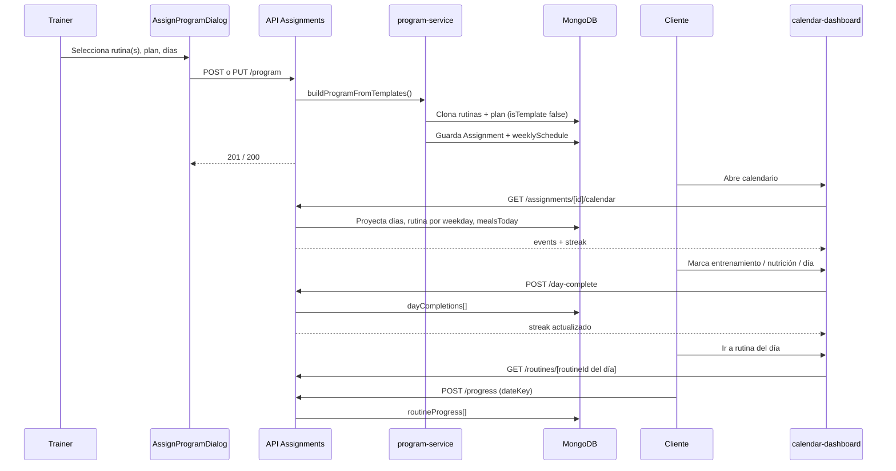

# Arquitectura del Sistema

> **Última actualización:** Junio 26, 2026

## Visión General

GymPro utiliza una arquitectura de **3 capas** basada en Next.js App Router, con un enfoque **multi-tenant** que permite aislar datos de múltiples gimnasios en una sola instancia.

```
┌─────────────────────────────────────────────────────┐
│          PRESENTACIÓN (React Components)            │
│  - UI Components (Shadcn/UI + Radix UI)            │
│  - Feature Components (por rol)                     │
│  - Layout Components                                │
│  - Client Components ("use client")                 │
│  - Server Components (default)                      │
└─────────────────────────────────────────────────────┘
                     ↓ ↑ (HTTP/JSON)
┌─────────────────────────────────────────────────────┐
│         LÓGICA DE NEGOCIO (API Routes)              │
│  - Route Handlers (app/api/*)                       │
│  - Middleware de autenticación (JWT)                │
│  - Validación de permisos por rol                   │
│  - Transformación de datos                          │
│  - Manejo de errores centralizado                   │
└─────────────────────────────────────────────────────┘
                     ↓ ↑ (Mongoose)
┌─────────────────────────────────────────────────────┐
│        PERSISTENCIA (MongoDB + Mongoose)            │
│  - Modelos de datos (12 schemas)                    │
│  - Validación de esquema                            │
│  - Hooks pre/post (bcrypt, validaciones)            │
│  - Índices compuestos para optimización             │
│  - Relaciones con populate                          │
└─────────────────────────────────────────────────────┘
```

## Arquitectura de Capas Detallada

### Capa de Presentación

**Tecnologías:**
- Next.js 16 (App Router)
- React 19 (Server Components + Client Components)
- TypeScript
- Tailwind CSS
- Shadcn/UI + Radix UI

**Estructura de Carpetas:**
```
components/
├── ui/              # 57 componentes base (button, card, input...)
├── admin/           # UI específica de administrador
├── auth/            # Login y registro
├── calendar/        # Calendario y eventos
├── client/          # Dashboard del cliente
├── layout/          # Header, sidebar, footer
├── meal-plans/      # Planes alimenticios
├── public/          # Componentes públicos (landing)
├── routines/        # Rutinas y ejercicios
└── trainer/         # Panel del entrenador
```

**Patrón de Composición:**
```typescript
// Componente orquestador (Server Component)
export default function ClientDashboard() {
  const user = await getUser(); // Server-side fetch
  return (
    <div>
      <TrainerInfoCard trainer={user.trainer} /> {/* Client Component */}
      <AssignedRoutineCard routine={user.routine} />
      <ProgressOverview data={user.progress} />
    </div>
  );
}

// Componente de feature (Client Component)
"use client";
export function TrainerInfoCard({ trainer }) {
  return (
    <Card> {/* UI Component */}
      <Avatar src={trainer.avatar} />
      <Button>Enviar mensaje</Button>
    </Card>
  );
}
```

### Capa de Lógica de Negocio

**Tecnologías:**
- Next.js API Routes (Route Handlers)
- JWT (jsonwebtoken)
- Zod (validación)

**Estructura de API (actualizada):**
```
app/api/
├── auth/                    # Login, registro, logout, me
├── users/                   # CRUD de usuarios, profile
├── gyms/                    # CRUD de gimnasios
├── routines/                # CRUD de rutinas (?templatesOnly=true)
├── exercises/               # CRUD de ejercicios
├── meal-plans/              # CRUD de planes (?templatesOnly=true)
├── assignments/             # CRUD de asignaciones
│   └── [id]/
│       ├── program/         # PUT — actualizar programa (Fase 3)
│       ├── calendar/        # GET — proyección mensual
│       ├── day-complete/    # POST/GET — completitud diaria
│       └── progress/        # POST — series por fecha
├── activity-log/            # GET — bitácora admin
├── notifications/           # unread-count, list, mark-read
├── calendar/                # Eventos unificados
├── products/                # Inventario
├── sales/                   # Ventas POS
├── gym-equipment/           # Equipamiento
├── messages/                # Mensajería
└── dashboard/               # Estadísticas por rol
```

**Módulos de dominio (`lib/`):**
```
lib/
├── assignment/
│   ├── program-service.ts   # buildProgramFromTemplates, clonación
│   ├── day-completion.ts    # dateKey, streak, completitud
│   ├── goal-tags.ts         # Filtro por meta del cliente
│   └── ref-id.ts            # extractRefId, getDocumentId
├── activity-log/            # recordActivitySafe, tipos
├── meal-plan/templates.ts   # Filtro plantillas, deduplicación
├── calendar/parse-event-date.ts
├── auth-server.ts           # verifyAuth, assertSameGym
├── csrf.ts                  # assertCsrf
└── models/                  # 14 schemas Mongoose
```

**Patrón de Autenticación:**
```typescript
// 1. Middleware de autenticación
export async function verifyAuth(req: NextRequest) {
  // Leer token desde cookie o header
  const token = req.cookies.get('auth-token')?.value || 
                req.headers.get('authorization')?.replace('Bearer ', '');
  
  // Verificar JWT
  const decoded = jwt.verify(token, JWT_SECRET);
  
  // Validar usuario activo en DB
  const user = await User.findById(decoded.userId);
  if (!user || !user.isActive) throw new Error('Unauthorized');
  
  return user;
}

// 2. Uso en endpoints
export async function GET(req: NextRequest) {
  const user = await verifyAuth(req);
  
  // Verificar permisos
  if (user.role !== 'admin' && user.role !== 'superadmin') {
    return NextResponse.json({ error: 'Forbidden' }, { status: 403 });
  }
  
  // Lógica de negocio...
}
```

**Patrón de Respuestas:**
```typescript
// Éxito
return NextResponse.json({
  message: 'Usuario creado exitosamente',
  data: user
}, { status: 201 });

// Error
return NextResponse.json({
  error: 'Email ya registrado',
  details: ['El email ya existe en la base de datos']
}, { status: 400 });
```

### Capa de Persistencia

**Tecnologías:**
- MongoDB (base de datos NoSQL)
- Mongoose (ODM con schemas y validación)

**Modelos Principales (14):**
1. **User** — Roles, perfil, `goal`, `trainerId`
2. **Gym** — Multi-tenant, slug
3. **Routine** — Plantilla (`isTemplate`) o clon (`sourceRoutineId`)
4. **Exercise** — Catálogo; clon con `sourceExerciseId`
5. **MealPlan** — Plantilla o clon (`sourceMealPlanId`, `isTemplate`)
6. **Assignment** — Programa activo del cliente
7. **CalendarEvent** — Eventos unificados
8. **Product** / **Sale** — Inventario y POS
9. **GymEquipment** — Equipamiento
10. **Message** — Mensajería
11. **BodyMeasurement** — Progreso corporal
12. **Notification** — Notificaciones in-app
13. **ActivityLog** — Bitácora del sistema

**Campos clave en Assignment:**
```typescript
{
  clientId, trainerId, gymId,
  routineId,           // Rutina principal (referencia)
  mealPlanId,          // Plan clonado del cliente
  durationWeeks,
  weeklySchedule: [{
    dayOfWeek: 0-6,
    isRestDay: boolean,
    routineId,         // Rutina clonada del día (puede variar)
    mealPlanId,
    title, notes
  }],
  routineProgress: [{ routineId, exerciseId, setNumber, dateKey, completedAt }],
  dayCompletions: [{ dateKey, workoutCompleted, nutritionCompleted, dayCompleted }],
  status: 'active' | 'completed' | 'pending' | 'cancelled'
}
```

**Nota sobre serialización `id` / `_id`:**
Varios modelos (`Assignment`, `MealPlan`, `Routine`) transforman `_id` → `id` en `toJSON`. Los endpoints que usan `.lean()` devuelven `_id` sin `id`. El frontend y servicios deben normalizar con `getDocumentId()` o `doc.id || doc._id`.

**Patrón de Schema:**
```typescript
const UserSchema = new Schema({
  name: { type: String, required: true },
  email: { type: String, required: true, unique: true },
  password: { type: String, required: true },
  role: { type: String, enum: ['superadmin', 'admin', 'trainer', 'client'], default: 'client' },
  gymId: { type: Schema.Types.ObjectId, ref: 'Gym', required: true },
  trainerId: { type: Schema.Types.ObjectId, ref: 'User' },
  isActive: { type: Boolean, default: true },
  // Información física
  age: Number,
  weight: Number,
  height: Number,
  gender: { type: String, enum: ['male', 'female', 'other'] },
  // ... más campos
}, {
  timestamps: true,
  toJSON: {
    transform: function(doc, ret) {
      ret.id = ret._id;
      delete ret._id;
      delete ret.__v;
      delete ret.password; // NUNCA exponer contraseñas
      return ret;
    }
  }
});

// Hook pre-save para hashear contraseña
UserSchema.pre('save', async function(next) {
  if (!this.isModified('password')) return next();
  this.password = await bcrypt.hash(this.password, 10);
  next();
});

// Índices para optimización
UserSchema.index({ gymId: 1, role: 1 });
UserSchema.index({ email: 1, gymId: 1 }, { unique: true });
```

## Arquitectura Multi-Tenant

### Estrategia: Discriminador por `gymId`

Todos los modelos principales tienen un campo `gymId` que los vincula a un gimnasio específico:

```typescript
// Todos los queries incluyen gymId para aislar datos
const users = await User.find({ gymId: currentGym._id });
const routines = await Routine.find({ gymId: currentGym._id });
```

### Middleware de Subdominios

```typescript
// middleware.ts
export function middleware(req: NextRequest) {
  const url = req.nextUrl;
  const hostname = req.headers.get('host') || '';
  
  // Extraer subdominio
  const subdomain = hostname.split('.')[0];
  
  // Redirigir según subdominio
  if (subdomain === 'admin') {
    url.pathname = `/superadmin${url.pathname}`;
  } else if (subdomain !== 'www' && subdomain !== 'localhost:3000') {
    url.pathname = `/portal/${subdomain}${url.pathname}`;
  }
  
  return NextResponse.rewrite(url);
}
```

**Flujo de Subdominios:**
```
alpha.gympro.com/dashboard
   ↓ Middleware detecta "alpha"
   ↓ Reescribe a /portal/alpha/dashboard
   ↓ Component busca Gym con slug="alpha"
   ↓ Filtra todos los datos con gymId=alpha._id
```

## Diagrama de Relaciones de Datos

```
┌─────────────┐
│     Gym     │
│  (Multi-   │
│   tenant)   │
└─────┬───────┘
      │
      ├──< (N) User (role: admin, trainer, client)
      │         │
      │         ├──< (N) Routine ──< (N) Exercise
      │         │         │
      │         │         └── sourceRoutineId (clonación)
      │         │
      │         ├──< (N) MealPlan
      │         │         └── sourceMealPlanId (clonación)
      │         │
      │         └──< (N) Assignment
      │                   │
      │                   ├── routineId / mealPlanId (clones)
      │                   ├── weeklySchedule[].routineId (por día)
      │                   ├── routineProgress[] (con dateKey)
      │                   ├── dayCompletions[] (racha)
      │                   └──< (N) CalendarEvent
      │
      ├──< (N) ActivityLog (bitácora admin)
      │
      ├──< (N) Notification
      │
      ├──< (N) Product ──< (N) Sale
      │
      ├──< (N) GymEquipment
      │
      ├──< (N) Message (trainer ↔ client)
      │
      └──< (N) BodyMeasurement
```

## Flujo de Datos: Caso de Uso Típico

### Escenario: Entrenador asigna o actualiza programa

```
1. PRESENTACIÓN
   - Trainer abre AssignProgramDialog
   - Selecciona rutina(s), plan opcional, días activos
   - Modo avanzado: rutina distinta por día

2. LÓGICA DE NEGOCIO
   Si NO hay asignación activa:
     POST /api/assignments
       ├── assertCsrf + verifyAuth
       ├── 409 si ya existe assignment activo
       └── buildProgramFromTemplates()
             ├── Clona rutina(s) por plantilla (cache por templateId)
             ├── Clona meal plan (sourceMealPlanId, isTemplate: false)
             └── Arma weeklySchedule con routineId/mealPlanId por día

   Si YA hay asignación activa:
     PUT /api/assignments/[id]/program
       ├── Misma lógica de clonación
       ├── Preserva dayCompletions / routineProgress (salvo resetProgress)
       └── No crea Assignment duplicado

3. PERSISTENCIA
   - Assignment actualizado o creado
   - Rutinas/planes clonados independientes de plantillas

4. CLIENTE
   - GET /api/assignments/[id]/calendar → días, comidas, rutina por weekday
   - POST day-complete → racha
   - POST progress con date → series del día
   - "Ir a rutina del día" carga rutina correcta vía routineId del calendario
```

### Diagrama: flujo trainer → cliente



## Patrones de Seguridad

### 1. Autenticación JWT
- Token almacenado en cookie HTTP-only
- Cookie con SameSite: lax (protección CSRF)
- Secure en producción (HTTPS only)
- Expiración: 7 días

### 2. Autorización por Rol (RBAC)
```typescript
const rolePermissions = {
  superadmin: ['*'], // Acceso total
  admin: ['gym:*', 'user:*', 'product:*', 'sale:*'],
  trainer: ['routine:*', 'mealplan:*', 'assignment:*', 'client:read'],
  client: ['profile:read', 'profile:update', 'calendar:read']
};
```

### 3. Validación Multicapa
- Frontend: react-hook-form + zod
- Backend: validación de permisos en cada endpoint
- Database: validación de esquema con Mongoose

### 4. Sanitización de Datos
- Contraseñas hasheadas con bcrypt (cost factor: 10)
- Emails convertidos a lowercase antes de guardar
- Nunca exponer contraseñas en respuestas (toJSON transform)

## Escalabilidad y Performance

### Índices de Base de Datos
```typescript
// Queries frecuentes optimizadas
UserSchema.index({ gymId: 1, role: 1 });
CalendarEventSchema.index({ userId: 1, date: 1 });
MessageSchema.index({ senderId: 1, receiverId: 1, updatedAt: -1 });
```

### Caching de Conexión MongoDB
```typescript
// Evita múltiples conexiones en development
declare global {
  var mongoose: { conn: Mongoose | null; promise: Promise<Mongoose> | null };
}

const cached = global.mongoose || { conn: null, promise: null };
if (!cached.promise) {
  cached.promise = mongoose.connect(MONGODB_URI);
}
```

### Server Components por Defecto
- Reduce bundle de JavaScript en cliente
- Mejora SEO y tiempo de carga inicial
- Client Components solo donde hay interactividad

## Diagrama de Despliegue

```
┌─────────────────────────────────────────┐
│            Vercel (Frontend)            │
│  - Next.js App (SSR + Static)          │
│  - Edge Functions (Middleware)          │
│  - CDN Global                           │
└─────────────┬───────────────────────────┘
              │ HTTPS
              ↓
┌─────────────────────────────────────────┐
│         MongoDB Atlas (Database)        │
│  - Cluster M10 (Producción)            │
│  - Automatic Backups                    │
│  - Connection Pooling                   │
└─────────────────────────────────────────┘
```

## Consideraciones Técnicas

### Ventajas de la Arquitectura Actual
- Monolito modular (fácil de desarrollar y debuggear)
- Multi-tenant eficiente (1 instancia, múltiples gimnasios)
- TypeScript end-to-end (type-safety)
- Server Components (performance)
- Mongoose (schemas tipados + validación)

### Limitaciones
- Monolito (dificulta escalar servicios individuales)
- Sin colas de mensajería (procesos síncronos)
- Sin cache layer (Redis)
- Sin CDN para assets privados (solo públicos con Vercel)

### Migraciones Futuras
- Microservicios para funcionalidades pesadas (reportes, IA)
- Redis para caching de sesiones y datos frecuentes
- S3/CloudFlare para almacenamiento de imágenes
- WebSockets para notificaciones en tiempo real
